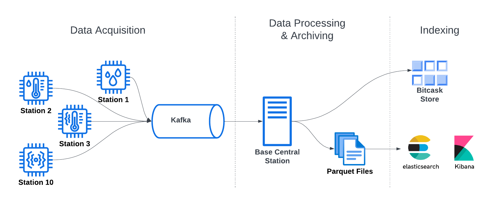

<h1 align="center">Weather-Stations-Monitoring</h1>

    

## Overview

Weather Stations Monitoring is a project that implements an architecture for a weather monitoring system. The system consists of multiple weather stations that emit readings for the current weather status to a central base station. This base station is responsible for data persistence and analysis.

## System Architecture

The system is composed of three stages:

1. **Data Acquisition**: Multiple weather stations feed a queueing service (Kafka) with their readings.
2. **Data Processing & Archiving**: The central base station consumes the streamed data and archives all data in Parquet files.
3. **Indexing**: Two variants of indexes are maintained:
   - A key-value store (Bitcask) for the latest reading from each individual station.
   - ElasticSearch/Kibana for running queries over the Parquet files.

## Tools Used

- **Java**
- **Bash Scripting**
- **Kafka**
- **Docker**
- **Kubernetes**
- **Java Flight Recorder**
- **ElasticSearch**
- **Kibana**
- **Key-value store (Bitcask)**
